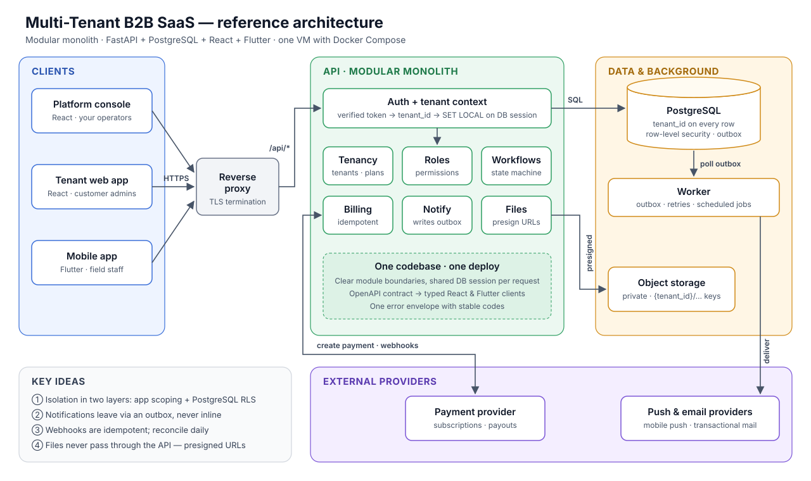
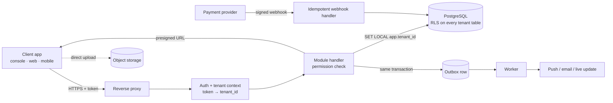

# Multi-Tenant B2B SaaS — a practical playbook

  

**The first customer is easy. The second customer is where multi-tenancy starts to hurt.**

Somewhere between customer two and customer twenty, a B2B product stops being "an app" and becomes a
system that must keep every customer's data apart, bill them correctly, notify the right people, and
survive deploys on a Friday afternoon — usually with a team of two or three engineers.

This repo is the playbook I wish I had at the start: the patterns, the failure modes, and the
checklists for building a multi-tenant B2B SaaS as a **modular monolith** on
**FastAPI + PostgreSQL + React + Flutter**. No microservices, no Kubernetes, no hype — just the things
that actually break, and how to stop them breaking.

> **Provenance & disclaimer**
> This is a personal project, written from scratch on my own time. It contains **no proprietary code,
> documentation, diagrams, schemas, data or business rules** from any employer or client. Every
> company name (Acme Co, Bluebird Ltd, …), code sketch, number and example is invented for
> illustration. The patterns described are general industry practice.
> This project is **not affiliated with, sponsored by, or endorsed by** any employer or client, past
> or present. Opinions are my own.

---

## How a request flows

---

## Contents

| # | Doc | You'll learn |
|---|-----|--------------|
| 01 | [Choosing a tenancy model](docs/01-choosing-a-tenancy-model.md) | Shared schema vs schema-per-tenant vs database-per-tenant, and how to pick |
| 02 | [Tenant context, end to end](docs/02-tenant-context-end-to-end.md) | Carrying `tenant_id` from token to SQL, with PostgreSQL row-level security as the safety net |
| 03 | [Roles & permissions](docs/03-roles-and-permissions.md) | Platform vs tenant roles, permission checks that scale, and routing traps |
| 04 | [Schema design & migrations](docs/04-schema-design-and-migrations.md) | Tenant-aware tables, expand/contract migrations, backups before every change |
| 05 | [Workflows & routing](docs/05-workflows-and-routing.md) | State machines, rule-based assignment, and audit trails |
| 06 | [Payments & billing](docs/06-payments-and-billing.md) | Webhooks, idempotency, marketplace payouts, reconciliation |
| 07 | [Notifications & real-time](docs/07-notifications-and-real-time.md) | The outbox pattern, SSE/WebSockets, push delivery |
| 08 | [File storage](docs/08-file-storage.md) | Presigned uploads, tenant-scoped keys, access checks |
| 09 | [One API, many clients](docs/09-one-api-many-clients.md) | Serving web consoles and mobile apps from one API without breaking old app versions |
| 10 | [Deploying with a small team](docs/10-deploying-with-a-small-team.md) | Single-VM Compose deploys, scripts that fail loudly, rollbacks |
| 11 | [Observability & incidents](docs/11-observability-and-incidents.md) | Structured logs, the few metrics that matter, lightweight runbooks |
| 12 | [Testing tenant isolation](docs/12-testing-tenant-isolation.md) | Tests that prove customer A can never see customer B |

Every doc follows the same shape: **the problem → the pattern → a code sketch → a diagram → a
failure-mode table → a checklist** you can copy into a PR template.

---

## Principles

These are opinions. They are the defaults I reach for until a real problem forces something else.

1. **Isolation is a feature, not a filter.** A missing `WHERE tenant_id = …` is a data breach, not a bug. Enforce it in two layers.
2. **Start with a modular monolith.** One deployable, clear internal modules, one database. Split only when a module has a genuinely different scaling or ownership need.
3. **The database is the last line of defence.** Use constraints, foreign keys and row-level security. Application code forgets; PostgreSQL doesn't.
4. **Every external event is delivered at least once.** Webhooks, pushes and jobs will be retried. Make handlers idempotent from day one.
5. **Scripts must fail loudly.** A deploy that prints "SUCCESS" after skipping a step is worse than one that crashes.
6. **Migrations are deploys.** Back up first, expand before you contract, and never ship a migration you haven't run against a copy of real-shaped data.
7. **Old mobile apps never die.** Design the API so yesterday's app build keeps working tomorrow.
8. **Boring technology wins.** Pick the tool your team can debug at 2 a.m.
9. **Write the checklist after the incident.** Then actually use it.

---

## How this was written

I wrote this with an AI assistant as a writing and review partner. The topics, structure, opinions
and lessons are mine, drawn from general experience building SaaS products; the assistant helped me
draft prose, tighten code sketches and check diagrams. Every page was reviewed and edited by me, and
all code is illustrative — read it, understand it, and adapt it rather than pasting it into
production.

---

## Roadmap

- [x] Core playbook (docs 01–12) and reference architecture diagram
- [ ] A small runnable reference app (FastAPI + PostgreSQL RLS + React) that demonstrates docs 02, 03 and 12
- [ ] Tenant onboarding & offboarding (data export, deletion, retention)
- [ ] Per-tenant configuration and feature flags without a flag service
- [ ] Rate limiting and noisy-neighbour protection inside a monolith
- [ ] Background jobs: when a database-backed queue is enough

Suggestions and corrections are welcome — open an issue.

---

## License

- **Documentation** (all Markdown and diagrams): [CC BY 4.0](https://creativecommons.org/licenses/by/4.0/) — share and adapt with credit.
- **Code sketches** (all code blocks and snippets): [MIT](https://opensource.org/licenses/MIT).

See [LICENSE.md](LICENSE.md). © 2026 Tharun Kumaar Udayakumar.
