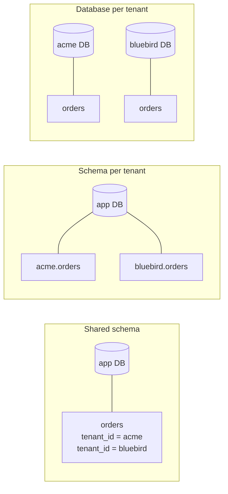

# 01 — Choosing a tenancy model

> **TL;DR** — For most early-stage B2B products, a **shared database with a `tenant_id` column on
> every tenant-owned table**, backed by PostgreSQL row-level security, is the right default. Move a
> specific customer to their own database only when a contract or a workload demands it.

## The problem

A *tenant* is one customer organisation — "Acme Co" with its admins, staff and data. The
tenancy model decides **where each tenant's rows physically live**. It affects:

- how easy it is to leak data between customers,
- how migrations run,
- how expensive each new customer is,
- and how painful it is to answer "can we host our data separately?" in a sales call.

It is one of the few decisions that is genuinely hard to reverse, so it is worth an hour of thought.

## The three models



| | Shared schema (`tenant_id`) | Schema per tenant | Database per tenant |
|---|---|---|---|
| Cost per new tenant | ~zero (one row) | Low (create schema + migrate) | High (provision + migrate + back up) |
| Isolation strength | Logical — relies on code + RLS | Medium — search_path mistakes still leak | Strong — separate credentials |
| Migrations | Run once | Run N times, can drift | Run N times, can drift |
| Cross-tenant reporting | Easy (one query) | Awkward (UNION across schemas) | Hard (ETL) |
| Noisy neighbours | Possible | Possible | Rare |
| Connection pooling | Simple | Tricky with `search_path` | One pool per tenant |
| Good for | Most SaaS, many small tenants | A handful of mid-size tenants | Regulated/enterprise tenants |

## The pattern I recommend

1. **Shared schema** for everyone by default.
2. **Every tenant-owned table** carries a non-null `tenant_id` foreign key.
3. **Two layers of enforcement**: the application scopes every query, *and* PostgreSQL row-level
   security (RLS) refuses rows from other tenants even if the application forgets (see
   [doc 02](02-tenant-context-end-to-end.md)).
4. **Keep a "silo escape hatch"**: write code so the database URL is resolved per tenant, even if
   today it always returns the same URL. Moving one enterprise tenant to its own database later then
   becomes an operational task, not a rewrite.

### Code sketch — the escape hatch

```python
# tenancy/routing.py
from functools import lru_cache
from sqlalchemy.ext.asyncio import create_async_engine, AsyncEngine

DEFAULT_DSN = "postgresql+asyncpg://app@db/app"

# In the database: tenants(id, slug, dedicated_dsn NULL)
@lru_cache(maxsize=256)
def engine_for(dsn: str) -> AsyncEngine:
    return create_async_engine(dsn, pool_size=5, max_overflow=5)

def engine_for_tenant(tenant) -> AsyncEngine:
    """Most tenants share the default database; a few may be siloed."""
    return engine_for(tenant.dedicated_dsn or DEFAULT_DSN)
```

Nothing here is clever. The value is that no other module ever builds its own engine — so the day you
need a silo, you change one function.

## What *not* to model as a tenant

A common mistake is to treat every grouping as a tenant. Keep a clear line:

- **Tenant** = the billing and data-isolation boundary (the company that signs the contract).
- **Workspace / site / team** = a grouping *inside* a tenant. It is a normal foreign key, not a
  tenancy boundary.

If you blur these, you end up with "tenants inside tenants" and permission checks nobody can reason
about.

## Failure modes

| Failure | Symptom | Prevention |
|---|---|---|
| Table added without `tenant_id` | Data visible to every customer | Lint migrations: every new table must have `tenant_id` or be on an allow-list of global tables |
| `tenant_id` nullable | Orphan rows that belong to "everyone" | `NOT NULL` + foreign key to `tenants(id)` |
| Global lookup tables mixed with tenant data | Tenant edits a "shared" record and changes it for all | Separate global reference tables; tenants get override rows, not edit rights |
| Schema-per-tenant drift | One tenant's schema missing a column → 500s for them only | Migrate all schemas in one job, fail the deploy if any fail |
| Premature database-per-tenant | Ops cost explodes with 50 tiny customers | Silo only on contractual or measured need |

## Checklist

- [ ] Tenancy model chosen and written down, with the reason.
- [ ] Every tenant-owned table has `tenant_id NOT NULL REFERENCES tenants(id)`.
- [ ] Global tables are explicitly listed and reviewed.
- [ ] Database engine is resolved through one function (`engine_for_tenant`).
- [ ] "Tenant" vs "grouping inside a tenant" is defined in the glossary.
- [ ] RLS is planned as a second layer (doc 02).
