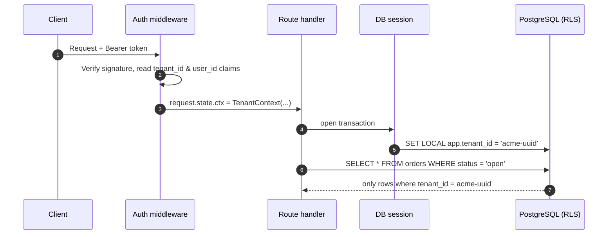

# 02 — Tenant context, end to end

> **TL;DR** — Resolve the tenant **once**, from a verified token, at the edge of the request. Carry it
> in a request-scoped context, set it on the database session with `SET LOCAL`, and let PostgreSQL
> row-level security reject anything that slips through.

## The problem

Every query in a multi-tenant app needs a tenant filter. Relying on every developer to remember
`.where(Model.tenant_id == tenant_id)` in every query, forever, is how data leaks happen. The goal is
to make the **safe path the default path** and the unsafe path loud.

## The flow



Key decisions:

- **Where does the tenant come from?** From a *verified* token claim or a server-side session —
  **never** from a header, query string or request body the client controls.
- **What if a user belongs to several tenants?** The token carries the *active* tenant; switching
  tenants issues a new token after checking membership.
- **Platform staff** (your own support team) get an explicit, audited "act as tenant" flow — not a
  magic bypass flag.

## Code sketch — context + session

```python
# tenancy/context.py
from dataclasses import dataclass
from uuid import UUID

@dataclass(frozen=True)
class TenantContext:
    tenant_id: UUID
    user_id: UUID
    roles: frozenset[str]
```

```python
# tenancy/deps.py
from fastapi import Depends, HTTPException, Request, status
from sqlalchemy import text
from sqlalchemy.ext.asyncio import AsyncSession

from .context import TenantContext
from .security import decode_verified_token   # your JWT/session verifier
from db import session_factory

async def get_ctx(request: Request) -> TenantContext:
    claims = decode_verified_token(request.headers.get("authorization"))
    if claims is None or "tenant_id" not in claims:
        raise HTTPException(status.HTTP_401_UNAUTHORIZED, "Not authenticated")
    return TenantContext(
        tenant_id=claims["tenant_id"],
        user_id=claims["sub"],
        roles=frozenset(claims.get("roles", [])),
    )

async def get_db(ctx: TenantContext = Depends(get_ctx)) -> AsyncSession:
    async with session_factory() as session:
        async with session.begin():
            # SET LOCAL lasts only for this transaction — safe with connection pools.
            await session.execute(
                text("SELECT set_config('app.tenant_id', :tid, true)"),
                {"tid": str(ctx.tenant_id)},
            )
            yield session
```

Why `set_config(..., true)` (equivalent to `SET LOCAL`) and not plain `SET`? A pooled connection is
reused by the next request. A session-level `SET` would leak one customer's tenant id into another
customer's request. Transaction-local settings disappear on commit or rollback.

## Code sketch — row-level security

```sql
-- Run as the table owner / migration role.
ALTER TABLE orders ENABLE ROW LEVEL SECURITY;
ALTER TABLE orders FORCE ROW LEVEL SECURITY;   -- applies even to the table owner

CREATE POLICY tenant_isolation ON orders
    USING      (tenant_id = current_setting('app.tenant_id', true)::uuid)
    WITH CHECK (tenant_id = current_setting('app.tenant_id', true)::uuid);
```

Notes:

- `current_setting(..., true)` returns `NULL` when the setting is missing, so **no tenant set means
  zero rows**, not all rows. That is the fail-closed behaviour you want.
- `WITH CHECK` stops inserts/updates that try to write another tenant's id.
- The **application role must not be a superuser** and must not have `BYPASSRLS`. Use a separate
  role for migrations and admin jobs.

## Background jobs and scripts

Jobs have no HTTP request, so they need the same discipline explicitly:

```python
async def run_for_tenant(tenant_id, job):
    async with session_factory() as session, session.begin():
        await session.execute(
            text("SELECT set_config('app.tenant_id', :tid, true)"), {"tid": str(tenant_id)}
        )
        await job(session)

# Fan out across tenants one at a time — never "all tenants in one transaction".
for tenant_id in await list_active_tenant_ids():
    await run_for_tenant(tenant_id, send_daily_digest)
```

## Failure modes

| Failure | Symptom | Prevention |
|---|---|---|
| Tenant taken from a client header | Any user can read any tenant by changing `X-Tenant-Id` | Only trust verified claims |
| Session-level `SET` with pooling | Random cross-tenant data under load | `SET LOCAL` / `set_config(..., true)` inside a transaction |
| App connects as superuser | RLS silently ignored | Dedicated non-superuser app role, no `BYPASSRLS` |
| RLS enabled but not `FORCE`d | Owner role sees everything in tests, hides bugs | `FORCE ROW LEVEL SECURITY` |
| Missing setting returns all rows | Policy written as `tenant_id::text = coalesce(setting, tenant_id::text)` | Fail closed: missing setting ⇒ `NULL` ⇒ no rows |
| Admin "bypass" flag | Support tooling leaks data, no audit | Explicit impersonation with audit log and expiry |

## Checklist

- [ ] Tenant id comes only from a verified token or server session.
- [ ] One dependency (`get_db`) opens the session and sets the tenant — handlers can't skip it.
- [ ] RLS enabled **and forced** on every tenant-owned table.
- [ ] App DB role is not superuser and has no `BYPASSRLS`.
- [ ] Background jobs set tenant context per tenant.
- [ ] Impersonation by platform staff is audited and time-limited.
- [ ] Isolation tests exist (doc 12).
