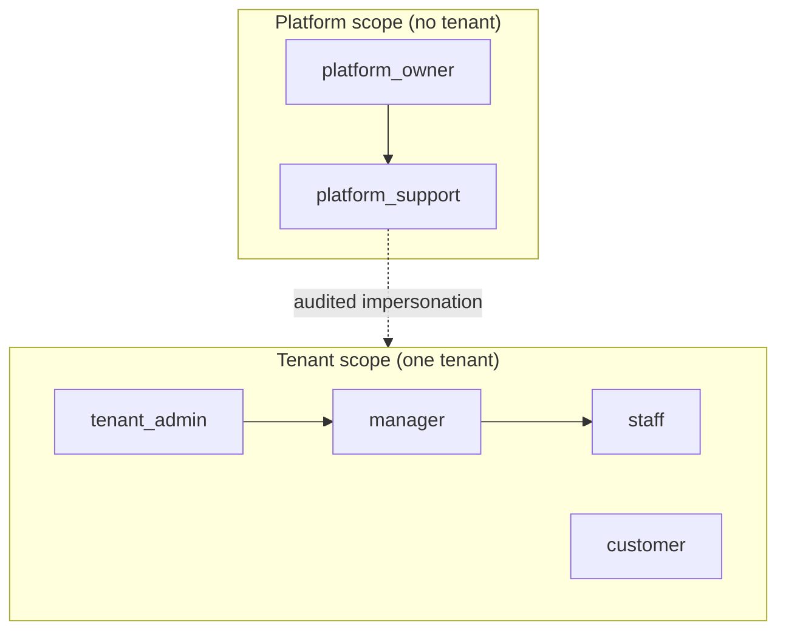

# 03 — Roles & permissions

> **TL;DR** — Separate **platform roles** (your company's staff) from **tenant roles** (your
> customer's staff). Check **permissions**, not role names, in code. Keep the role → permission map in
> one place, and write tests for the routes, not just the functions.

## The problem

B2B products have at least two worlds of users:

- **Platform side** — your own operators who onboard tenants, handle billing, and help with support.
- **Tenant side** — each customer's admins, managers, field staff and end customers.

The early shortcut is `if user.role == "admin"` scattered through handlers. Six months later there
are nine roles, three of them "almost admin", and nobody can say who can refund an invoice.

## The model



- A **role** is a named bundle of **permissions**.
- A **membership** links a user to a tenant with one or more roles.
- A user can hold memberships in several tenants (consultants, agencies, group companies).

```sql
CREATE TABLE memberships (
    user_id   uuid NOT NULL REFERENCES users(id),
    tenant_id uuid NOT NULL REFERENCES tenants(id),
    role      text NOT NULL,
    PRIMARY KEY (user_id, tenant_id, role)
);
```

## Code sketch — permission checks

```python
# auth/permissions.py
from enum import StrEnum

class Perm(StrEnum):
    WORK_ITEM_READ = "work_item:read"
    WORK_ITEM_ASSIGN = "work_item:assign"
    INVOICE_REFUND = "invoice:refund"
    MEMBER_MANAGE = "member:manage"

ROLE_PERMS: dict[str, set[Perm]] = {
    "tenant_admin": set(Perm),
    "manager": {Perm.WORK_ITEM_READ, Perm.WORK_ITEM_ASSIGN},
    "staff": {Perm.WORK_ITEM_READ},
    "customer": {Perm.WORK_ITEM_READ},   # further narrowed to "own" records by query scope
}

def perms_for(roles: frozenset[str]) -> set[Perm]:
    return set().union(*(ROLE_PERMS.get(r, set()) for r in roles))
```

```python
# auth/deps.py
from fastapi import Depends, HTTPException, status
from tenancy.deps import get_ctx

def require(*needed: Perm):
    def checker(ctx=Depends(get_ctx)):
        missing = set(needed) - perms_for(ctx.roles)
        if missing:
            raise HTTPException(status.HTTP_403_FORBIDDEN, "Insufficient permissions")
        return ctx
    return checker

@router.post("/work-items/{item_id}/actions/assign")
async def assign_work_item(item_id: UUID, body: AssignIn,
                           ctx=Depends(require(Perm.WORK_ITEM_ASSIGN)), db=Depends(get_db)):
    ...
```

Permissions answer **"may this user do this kind of action?"**. They do not answer **"on which
records?"** — that is the job of query scoping (tenant via RLS, plus ownership filters like
`created_by = :user_id` for customers).

## The routing trap

In FastAPI (and most routers), routes match **in registration order**. This bites role-specific
endpoints:

```python
@router.get("/work-items/{item_id}")      # registered first
async def get_work_item(item_id: UUID): ...

@router.get("/work-items/assigned-to-me")   # never reached: "assigned-to-me" is parsed as item_id
async def my_work_items(): ...
```

Symptoms: a 422 ("invalid UUID") or, worse with string ids, the wrong handler with the wrong
permission check. Fixes:

- Register **static paths before parameterised ones**.
- Type path params strictly (`UUID`, not `str`) so mismatches fail fast.
- Add a test that lists the app's routes and asserts no static path is shadowed.

```python
def test_no_shadowed_routes(app):
    seen = []
    for r in app.routes:
        for earlier in seen:
            if earlier.path_regex.match(r.path) and "{" not in r.path:
                raise AssertionError(f"{r.path} is shadowed by {earlier.path}")
        seen.append(r)
```

## Failure modes

| Failure | Symptom | Prevention |
|---|---|---|
| Role-name checks in handlers | Adding a role means editing 40 files | Check permissions; one role → permission map |
| Permission check only in the UI | API callable directly by lower roles | Enforce on the server, UI only hides buttons |
| Platform staff get tenant data by default | Support sees everything, no trail | Impersonation flow with reason + audit log |
| Shadowed routes | Wrong handler / wrong checks for a role-specific path | Static before dynamic; route shadow test |
| "Can do action" confused with "on which record" | Customer reads another customer's work item in the same tenant | Permission check **and** ownership scope |
| Stale roles in long-lived tokens | Removed admin keeps access for days | Short token TTL + refresh checks membership |

## Checklist

- [ ] Platform and tenant roles are separate namespaces.
- [ ] Handlers check permissions via one dependency, never role names.
- [ ] Record-level scope (ownership) is enforced in queries.
- [ ] Route shadowing test runs in CI.
- [ ] Impersonation is audited.
- [ ] Token lifetime is short enough that role removals take effect quickly.
