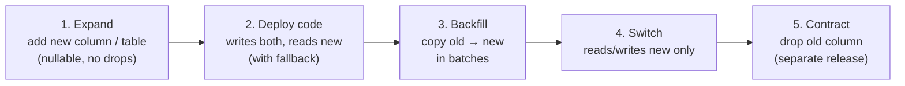

# 04 — Schema design & migrations

> **TL;DR** — Put `tenant_id` first in composite keys and indexes, make uniqueness tenant-scoped,
> and treat every migration as a deploy: **back up, expand, migrate data, switch code, contract.**

## Tenant-aware table design

```sql
CREATE TABLE work_items (
    id          uuid PRIMARY KEY DEFAULT gen_random_uuid(),
    tenant_id   uuid NOT NULL REFERENCES tenants(id),
    number      integer NOT NULL,              -- human-friendly, per tenant: #1, #2, ...
    title       text NOT NULL CHECK (length(title) BETWEEN 1 AND 200),
    status      text NOT NULL DEFAULT 'open',
    created_by  uuid NOT NULL REFERENCES users(id),
    created_at  timestamptz NOT NULL DEFAULT now(),
    UNIQUE (tenant_id, number)                 -- unique per tenant, not globally
);

CREATE INDEX work_items_tenant_status_idx ON work_items (tenant_id, status, created_at DESC);
```

Rules of thumb:

- **Uniqueness is almost always per tenant.** `UNIQUE (email)` on a staff table means two customers
  can't both have `alex@example.com` as a contact. Use `UNIQUE (tenant_id, email)`.
- **Lead indexes with `tenant_id`.** Nearly every query filters by tenant first.
- **Cross-table references stay inside the tenant.** A composite foreign key makes it impossible
  to attach Acme's work item to Bluebird's customer:

```sql
ALTER TABLE customers ADD UNIQUE (tenant_id, id);
ALTER TABLE work_items
    ADD COLUMN customer_id uuid,
    ADD FOREIGN KEY (tenant_id, customer_id) REFERENCES customers (tenant_id, id);
```

- **Soft delete deliberately.** If you add `archived_at`, add it to partial unique indexes too
  (`WHERE archived_at IS NULL`) or archived rows block new ones.
- **Per-tenant counters** (work item #1, #2…) need a lock or a counter table — `max(number)+1` races
  under concurrency.

```sql
CREATE TABLE tenant_counters (
    tenant_id uuid NOT NULL REFERENCES tenants(id),
    name      text NOT NULL,
    value     bigint NOT NULL DEFAULT 0,
    PRIMARY KEY (tenant_id, name)
);

-- Atomic next number:
UPDATE tenant_counters SET value = value + 1
WHERE tenant_id = :tid AND name = 'item'
RETURNING value;
```

## Migrations: expand → migrate → contract

A migration that renames a column in one step breaks every running instance still using the old
name. With zero or near-zero downtime you split it:



### Code sketch — an Alembic expand step

```python
"""add work_items.priority (expand)"""
from alembic import op
import sqlalchemy as sa

def upgrade():
    op.add_column("work_items", sa.Column("priority", sa.Text(), nullable=True))
    # Adding a column with a constant default is cheap in modern PostgreSQL,
    # but backfills of computed values should be batched, not done here.

def downgrade():
    op.drop_column("work_items", "priority")
```

### Code sketch — batched backfill

```python
BATCH = 1_000

async def backfill_priority(session):
    while True:
        result = await session.execute(text("""
            UPDATE work_items SET priority = 'normal'
            WHERE id IN (
                SELECT id FROM work_items WHERE priority IS NULL LIMIT :n
                FOR UPDATE SKIP LOCKED
            )
        """), {"n": BATCH})
        await session.commit()
        if result.rowcount == 0:
            break
```

Backfills run as the migration role (RLS bypass is intentional here), in small batches, so they
don't hold long locks or bloat one giant transaction.

## Migration safety rules

1. **Back up before every migration** that touches data, and know how to restore it.
2. **Run migrations as a separate step** before new code starts — not on app startup across N
   replicas racing each other.
3. **Set a lock timeout** so a migration waiting on a busy table fails fast instead of blocking
   every query behind it:

   ```sql
   SET lock_timeout = '5s';
   ```

4. **Create indexes concurrently** on large tables (`CREATE INDEX CONCURRENTLY`, outside a
   transaction).
5. **One head only.** Two branches that both add migrations produce two Alembic heads; CI should fail
   on `alembic heads` returning more than one.
6. **Every new table gets `tenant_id` + RLS**, or is explicitly listed as global.

## Failure modes

| Failure | Symptom | Prevention |
|---|---|---|
| Global unique constraint | Second customer can't create a record with the same email/code | `UNIQUE (tenant_id, …)` |
| Cross-tenant foreign key | Record in tenant A references tenant B's row | Composite FKs including `tenant_id` |
| Rename in one step | Old pods crash on missing column mid-deploy | Expand/contract across releases |
| Migration on app startup | Replicas race, half-applied schema | Dedicated migration step |
| Long lock on a hot table | Whole app stalls during deploy | `lock_timeout`, concurrent indexes, batched backfills |
| Multiple Alembic heads | Deploy fails or skips a migration | CI check for a single head |
| No backup before migrating | Bad data migration is permanent | Automated dump + restore test |

## Checklist

- [ ] New tables: `tenant_id NOT NULL`, tenant-leading indexes, RLS policy.
- [ ] Unique constraints are tenant-scoped.
- [ ] Cross-table references use composite keys with `tenant_id`.
- [ ] Destructive changes split into expand/contract releases.
- [ ] Backup taken and restore path known before running.
- [ ] `lock_timeout` set; large indexes built concurrently.
- [ ] CI fails on multiple migration heads.
