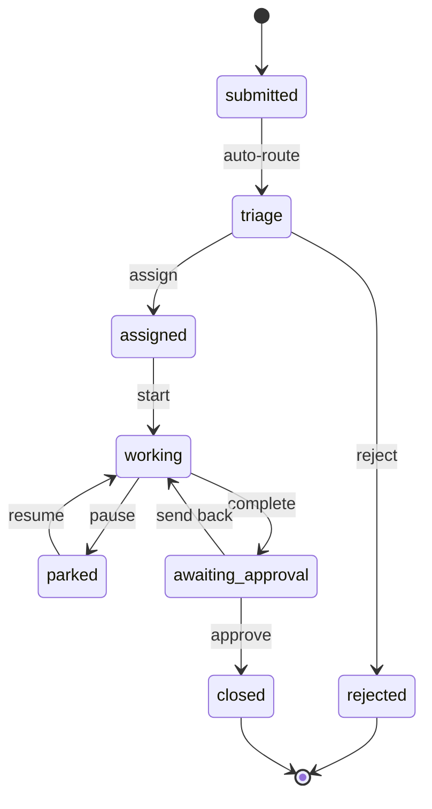

# 05 — Workflows & routing

> **TL;DR** — Model business processes as **explicit state machines** with a transition table, route
> new work with **data-driven rules** that each tenant can configure, and write an **append-only
> event log** for every transition.

## The problem

Most B2B products are workflow engines in disguise: a request comes in, someone reviews it, it gets
assigned, worked on, approved, closed. The first version is usually a `status` string and a pile of
`if` statements across handlers. Then tenants start asking:

- "Can requests of type X skip review for us?"
- "Can urgent items go straight to the on-call team?"
- "Who changed this to *closed*, and when?"

If the rules live in scattered `if`s, every answer is a code change and a deploy.

## Pattern 1 — an explicit state machine



### Code sketch — transitions as data

```python
# workflow/machine.py
from dataclasses import dataclass

@dataclass(frozen=True)
class Transition:
    action: str
    source: str
    target: str
    permission: str

TRANSITIONS = [
    Transition("assign",    "triage",            "assigned",          "work_item:assign"),
    Transition("reject",    "triage",            "rejected",          "work_item:assign"),
    Transition("start",     "assigned",          "working",           "work_item:work"),
    Transition("pause",     "working",           "parked",            "work_item:work"),
    Transition("resume",    "parked",            "working",           "work_item:work"),
    Transition("complete",  "working",           "awaiting_approval", "work_item:work"),
    Transition("approve",   "awaiting_approval", "closed",            "work_item:approve"),
    Transition("send_back", "awaiting_approval", "working",           "work_item:approve"),
]
_BY_KEY = {(t.action, t.source): t for t in TRANSITIONS}

class InvalidTransition(Exception): ...

def next_state(action: str, current: str, perms: set[str]) -> Transition:
    t = _BY_KEY.get((action, current))
    if t is None:
        raise InvalidTransition(f"Cannot {action} from {current}")
    if t.permission not in perms:
        raise PermissionError(action)
    return t
```

The API exposes **actions** (`POST /work-items/{id}/actions/approve`), not a writable `status` field.
Clients can't jump from `submitted` to `closed` by PATCHing a string.

### Concurrency

Two managers click "assign" at the same moment. Guard the transition with the expected current
state:

```sql
UPDATE work_items SET status = :target, assignee_id = :assignee, version = version + 1
WHERE id = :id AND status = :source AND version = :expected_version;
-- 0 rows updated ⇒ someone else moved it first ⇒ return 409 Conflict
```

## Pattern 2 — rule-based routing

Routing decides **where new work goes first**. Keep the rules as rows so each tenant can configure
them without a deploy:

```sql
CREATE TABLE routing_rules (
    id          uuid PRIMARY KEY DEFAULT gen_random_uuid(),
    tenant_id   uuid NOT NULL REFERENCES tenants(id),
    priority    integer NOT NULL,            -- lower runs first
    match_type  text,                        -- NULL = any
    match_urgency text,                      -- NULL = any
    target_team uuid NOT NULL REFERENCES teams(id),
    skip_triage boolean NOT NULL DEFAULT false,
    UNIQUE (tenant_id, priority)
);
```

```python
def route(item, rules) -> tuple[UUID, str]:
    for r in sorted(rules, key=lambda r: r.priority):
        if r.match_type not in (None, item.type):
            continue
        if r.match_urgency not in (None, item.urgency):
            continue
        return r.target_team, ("assigned" if r.skip_triage else "triage")
    return DEFAULT_TRIAGE_TEAM, "triage"     # always have a fallback
```

Two design choices worth making explicitly:

- **Assign vs offer.** *Assign* puts the work on one person. *Offer* makes it visible to a team and
  the first person to claim it wins (use the conditional `UPDATE` above). Offering reduces
  bottlenecks; assigning gives clear ownership. Many tenants want both, per rule.
- **First match wins.** Priority order, one match, one fallback. Rule systems that combine
  multiple matches become impossible to explain to customers.

## Pattern 3 — the event log

```sql
CREATE TABLE work_item_events (
    id         bigserial PRIMARY KEY,
    tenant_id  uuid NOT NULL,
    item_id  uuid NOT NULL REFERENCES work_items(id),
    actor_id   uuid,                 -- NULL for system/routing
    action     text NOT NULL,
    from_state text,
    to_state   text,
    payload    jsonb NOT NULL DEFAULT '{}',
    created_at timestamptz NOT NULL DEFAULT now()
);
```

Write the event **in the same transaction** as the state change. It powers the activity timeline,
audit questions, SLA reports and notification triggers (doc 07).

## Failure modes

| Failure | Symptom | Prevention |
|---|---|---|
| Writable `status` field | Clients skip required steps | Action endpoints + transition table |
| Double assignment | Two people work the same item | Conditional update on current state/version → 409 |
| No fallback route | New items silently go nowhere | Default triage team, alert on fallback use |
| Rules hard-coded per customer | `if tenant == ...` in code | Routing rules as tenant-owned rows |
| Overlapping rules | Unpredictable routing | Unique priority, first match wins |
| No history | "Who closed this?" has no answer | Append-only event log in the same transaction |

## Checklist

- [ ] States and transitions are defined in one table/module.
- [ ] API exposes actions, not a raw status field.
- [ ] Transitions are guarded against concurrent updates.
- [ ] Routing rules are data, per tenant, with a fallback.
- [ ] Every transition writes an event in the same transaction.
- [ ] State diagram in the docs matches the code (generate it if you can).
