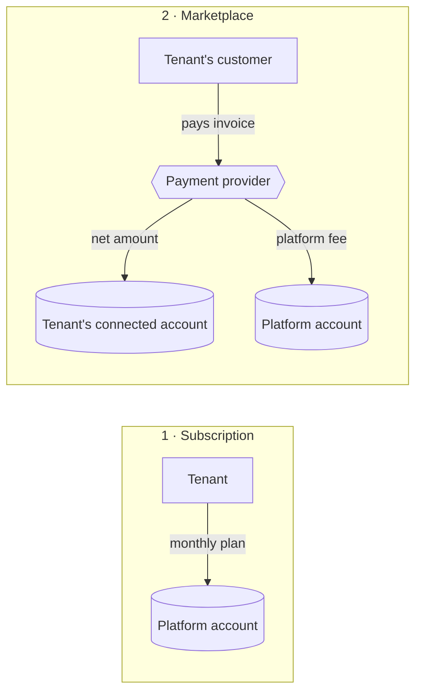
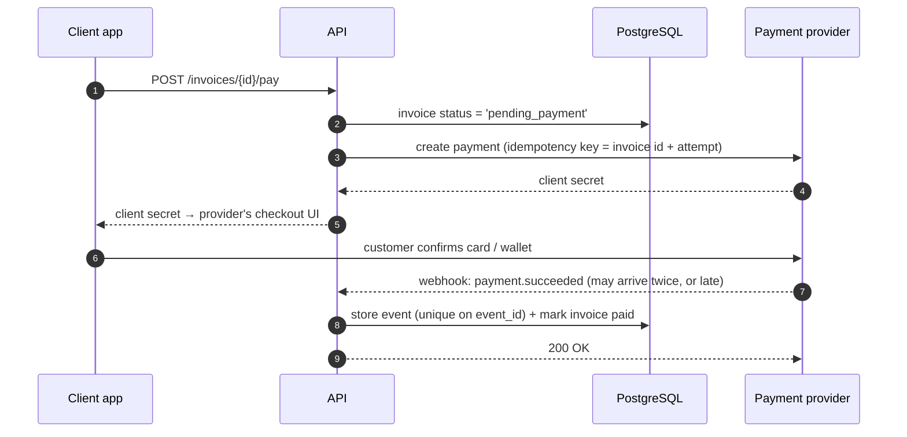

# 06 — Payments & billing

> **TL;DR** — Your database is the source of truth for **what is owed**; the payment provider is the
> source of truth for **what was paid**. Connect them with **idempotent webhook handlers**, store
> every provider event, and run a daily **reconciliation** job.

This doc is provider-neutral. Every mainstream payment provider has the same building blocks:
customers, payment intents/charges, subscriptions, connected (sub-merchant) accounts, and webhooks.

## Two kinds of money flow

B2B platforms usually have one or both:

1. **Subscription billing** — the tenant pays *you* for the software (per seat, per plan, per usage).
2. **Marketplace payments** — the tenant's own customers pay the *tenant* through your platform,
   and you may take a platform fee. The tenant has a **connected account** with the provider;
   funds settle to them, not to you.



Keep these as **separate modules with separate tables**. Mixing "what the tenant owes us" with "what
the tenant's customers owe the tenant" in one `payments` table is a classic source of reporting bugs.

## The lifecycle of one invoice payment



Rules:

- **The redirect back to your app is not proof of payment.** Only a verified webhook (or a
  server-side status fetch) is.
- **Never trust amounts from the client.** The server computes the amount from the invoice.
- **Create provider objects with an idempotency key**, so a retried request doesn't charge twice.

## Code sketch — an idempotent webhook handler

```python
# billing/webhooks.py
from fastapi import APIRouter, Depends, HTTPException, Request
from sqlalchemy import insert
from sqlalchemy.exc import IntegrityError

router = APIRouter()

@router.post("/webhooks/payments")
async def payment_webhook(request: Request, db=Depends(get_admin_db)):
    raw = await request.body()
    event = provider.verify_and_parse(raw, request.headers)   # raises on bad signature
    if event is None:
        raise HTTPException(400, "Invalid signature")

    try:
        # provider_events.event_id is UNIQUE — duplicates fail here.
        await db.execute(insert(ProviderEvent).values(
            event_id=event.id, type=event.type, payload=event.data, received_at=utcnow(),
        ))
    except IntegrityError:
        return {"status": "duplicate"}          # already processed: still 200

    handler = HANDLERS.get(event.type)
    if handler:
        await handler(db, event)                # same transaction as the insert
    return {"status": "ok"}

async def on_payment_succeeded(db, event):
    invoice = await db.get(Invoice, event.data["metadata"]["invoice_id"], with_for_update=True)
    if invoice.status == "paid":
        return                                  # out-of-order or replayed event
    if event.data["amount"] != invoice.amount_minor:
        await flag_for_review(db, invoice, event)   # never silently accept a mismatch
        return
    invoice.status = "paid"
    invoice.paid_at = event.created_at

HANDLERS = {"payment.succeeded": on_payment_succeeded}
```

Notes:

- Verify the signature against the **raw body** — parsing JSON first can change bytes and break it.
- The webhook endpoint has no user token. It uses an admin/system session and finds the tenant from
  **metadata you attached when creating the payment** (`tenant_id`, `invoice_id`).
- Return **2xx quickly**. Slow handlers cause provider retries and duplicate deliveries.

## Money rules that save you later

- Store amounts as **integers in minor units** (cents) plus a **currency code**. Never floats.
- Store the **provider's ids** on your rows (`provider_payment_id`, `provider_account_id`).
- Record fees and refunds as **separate ledger rows**, not by editing the original amount.
- **Connected account onboarding** has states (pending, restricted, enabled). Block payouts in the UI
  until the provider says the account can receive them, and request only the capabilities you need.

## Reconciliation

Webhooks get lost, endpoints go down, humans refund things from the provider dashboard. Once a day:

```python
async def reconcile(day):
    ours = await load_payments(day)                      # from our DB
    theirs = await provider.list_payments(created=day)   # from the provider API
    for pid in theirs.keys() - ours.keys():
        await alert("Payment at provider but not in DB", pid)
    for pid in ours.keys() & theirs.keys():
        if ours[pid].status != theirs[pid].status or ours[pid].amount != theirs[pid].amount:
            await alert("Mismatch", pid)
```

## Failure modes

| Failure | Symptom | Prevention |
|---|---|---|
| Duplicate webhook processed twice | Double credit, duplicate receipts | Unique `event_id` + idempotent handlers |
| Trusting the success redirect | Invoices marked paid that weren't | Only webhooks / server fetch change status |
| Float amounts | Off-by-one-cent totals | Integer minor units + currency |
| Client-supplied amount | Customer pays 1 instead of 100 | Server computes amount from invoice |
| Out-of-order events | "refunded" overwritten by late "succeeded" | Check current state before transitions |
| Signature check on parsed JSON | All webhooks rejected, or none verified | Verify on raw body |
| No reconciliation | Silent drift between provider and DB | Daily job with alerts |
| Over-requested account capabilities | Connected-account onboarding stalls | Request only what you use |

## Checklist

- [ ] Subscription billing and marketplace payments are separate modules.
- [ ] Every provider event stored with a unique id before handling.
- [ ] Handlers are idempotent and state-aware.
- [ ] Amounts are integers in minor units with currency.
- [ ] Idempotency keys on every create call.
- [ ] Webhook signatures verified on the raw body.
- [ ] Daily reconciliation job with alerts.
- [ ] Test mode and live mode keys can never be mixed (separate config, startup check).
