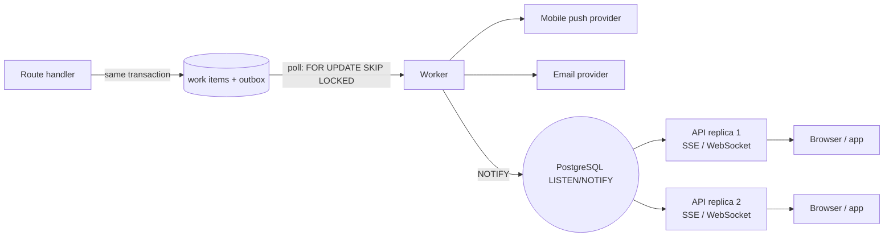

# 07 — Notifications & real-time

> **TL;DR** — Never send a notification from inside a request handler. Write a row to an **outbox
> table in the same transaction** as the business change, and let a **worker** deliver it to push,
> email and live connections — retrying safely.

## The problem

"When a work item is assigned, notify the assignee" sounds like one line of code. In practice:

- The push provider is slow or down → the API request hangs or fails.
- The transaction rolls back *after* the push was sent → the user gets a notification for something
  that never happened.
- The process crashes between commit and send → the notification is lost forever.
- The app runs on two replicas → a user connected to replica A never hears about an event on B.

## The pattern — transactional outbox



1. The handler writes the business change **and** an `outbox` row in one transaction. Either both
   exist or neither does.
2. A worker claims pending rows with `FOR UPDATE SKIP LOCKED`, so several workers never grab the
   same row.
3. The worker delivers to each channel and records the result, retrying with backoff.
4. For live UI updates, the worker (or a trigger) emits a lightweight `NOTIFY`; every API replica
   `LISTEN`s and forwards to its own connected clients.

PostgreSQL already gives you a durable queue (the outbox table) and a fan-out bus
(`LISTEN/NOTIFY`). For a moderate-scale monolith, that is usually enough — no extra broker to run.

## Code sketch — writing to the outbox

```sql
CREATE TABLE outbox (
    id           bigserial PRIMARY KEY,
    tenant_id    uuid NOT NULL,
    recipient_id uuid NOT NULL,
    kind         text NOT NULL,                 -- 'work_item.assigned'
    payload      jsonb NOT NULL,
    dedupe_key   text NOT NULL,                 -- e.g. 'work_item.assigned:{item}:{version}'
    status       text NOT NULL DEFAULT 'pending',
    attempts     int  NOT NULL DEFAULT 0,
    next_try_at  timestamptz NOT NULL DEFAULT now(),
    created_at   timestamptz NOT NULL DEFAULT now(),
    UNIQUE (dedupe_key)
);
CREATE INDEX outbox_pending_idx ON outbox (next_try_at) WHERE status = 'pending';
```

```python
async def assign(db, item, assignee_id, actor):
    item.assignee_id = assignee_id
    item.version += 1
    db.add(Outbox(
        tenant_id=item.tenant_id,
        recipient_id=assignee_id,
        kind="work_item.assigned",
        payload={"item_id": str(item.id), "number": item.number, "by": actor.name},
        dedupe_key=f"work_item.assigned:{item.id}:{item.version}",
    ))
    # commit happens in the request's session dependency
```

## Code sketch — the worker loop

```python
CLAIM = text("""
    UPDATE outbox SET status = 'sending', attempts = attempts + 1
    WHERE id IN (
        SELECT id FROM outbox
        WHERE status = 'pending' AND next_try_at <= now()
        ORDER BY id LIMIT 50
        FOR UPDATE SKIP LOCKED
    )
    RETURNING *
""")

async def worker_tick(db):
    async with db.begin():
        rows = (await db.execute(CLAIM)).mappings().all()
    for row in rows:
        try:
            await deliver(row)                       # push / email / NOTIFY
            status, next_try = "sent", None
        except TransientError:
            status = "pending" if row["attempts"] < 8 else "failed"
            next_try = utcnow() + timedelta(seconds=2 ** row["attempts"] * 5)
        except PermanentError:                       # e.g. push token no longer valid
            status, next_try = "failed", None
        async with db.begin():
            await db.execute(update(Outbox).where(Outbox.id == row["id"])
                             .values(status=status, next_try_at=next_try or utcnow()))
```

Also add a sweeper that resets rows stuck in `sending` for more than a few minutes (the worker
crashed mid-batch). Delivery is **at least once**, so the client must tolerate duplicates — which
is why every payload carries stable ids.

## Real-time connections

- **SSE (Server-Sent Events)** is often enough for web dashboards: one-way, plain HTTP,
  auto-reconnect built into browsers. Use WebSockets when you truly need client → server messages.
- **Authenticate the connection** with the same token rules as the API, and subscribe the
  connection only to channels for its `(tenant_id, user_id)`. Never let the client pick a channel
  name freely.
- **Real-time is a hint, not the data.** Send "work item 42 changed"; the client refetches through the
  normal API (which enforces permissions). This avoids leaking fields a user shouldn't see.
- **Mobile apps in the background** don't hold sockets — that's what push is for. Send push *and*
  the live event; the app dedupes by id.
- **Keep the notification path consistent** between clients. If the web and mobile apps call
  different notification endpoints or paths, one of them will silently break on the next refactor.
  Put the path in a shared API contract (doc 09).

## Failure modes

| Failure | Symptom | Prevention |
|---|---|---|
| Send inside the request | Slow API, notifications for rolled-back changes | Outbox in the same transaction |
| Crash after commit, before send | Lost notifications | Worker reads from durable outbox |
| Two workers send the same row | Duplicate pushes | `FOR UPDATE SKIP LOCKED` + `dedupe_key` |
| In-memory connection registry with 2+ replicas | Users on the "other" replica miss updates | Fan out through `LISTEN/NOTIFY` (or a broker at scale) |
| Client chooses its channel | User subscribes to another tenant's events | Server derives channels from the token |
| Full records pushed over the socket | Data leak to low-permission users | Send ids; client refetches via API |
| Dead push tokens retried forever | Queue fills with failures | Mark token invalid on permanent errors |

## Checklist

- [ ] Every notification starts as an outbox row in the business transaction.
- [ ] Worker claims with `SKIP LOCKED`, retries with backoff, has a max attempts.
- [ ] Stuck `sending` rows are swept.
- [ ] Live channels are derived server-side from `(tenant_id, user_id)`.
- [ ] Payloads are small and id-based; clients refetch.
- [ ] Web and mobile use the same documented notification endpoints.
- [ ] Multi-replica fan-out tested with at least two API instances.
