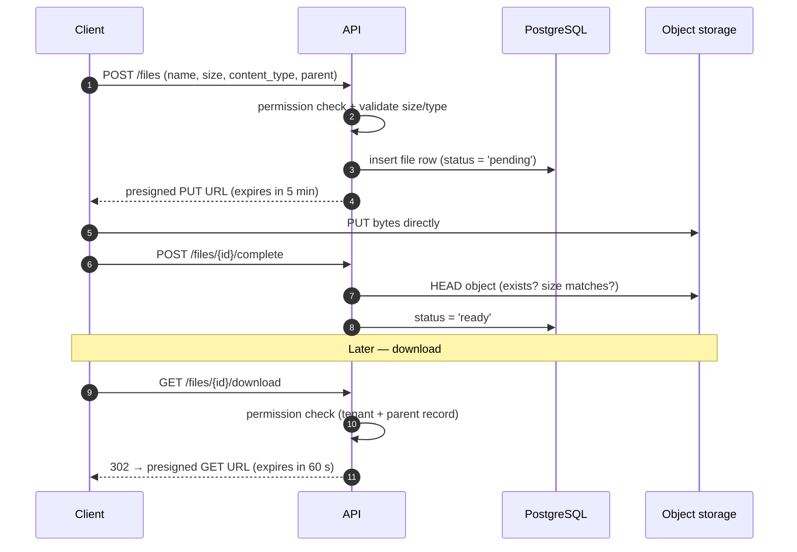

# 08 — File storage

> **TL;DR** — Files go to **object storage**, metadata goes to **PostgreSQL**. Clients upload and
> download directly with **short-lived presigned URLs** that the API issues only after a permission
> check. Every object key starts with the tenant id.

## The problem

Attachments, photos, signed documents, exports. Streaming them through your API wastes memory and
bandwidth, and storing them on the app server's disk breaks the moment you run two instances or
rebuild a container. But handing out a public bucket URL is a data leak waiting to happen.

## The pattern



## Key layout

```text
{tenant_id}/{module}/{parent_id}/{file_id}.{ext}

8f14…/work-items/3c9a…/b71e….jpg
8f14…/exports/2026-09/5d02….csv
```

- **Tenant first**: lifecycle rules, per-tenant usage reports and full tenant deletion become
  simple prefix operations.
- **Server-generated ids**, never the user's filename, in the key. Keep the original filename in the
  database for display and `Content-Disposition`.
- Buckets are **private**. There is no public read.

## Code sketch — issuing an upload URL

```python
# files/api.py
ALLOWED = {"image/jpeg", "image/png", "application/pdf"}
MAX_BYTES = 20 * 1024 * 1024

class FileIn(BaseModel):
    name: constr(min_length=1, max_length=200)
    size: conint(gt=0, le=MAX_BYTES)
    content_type: str
    parent_type: Literal["item", "customer"]
    parent_id: UUID

@router.post("/files", status_code=201)
async def create_upload(body: FileIn, ctx=Depends(require(Perm.FILE_WRITE)), db=Depends(get_db)):
    if body.content_type not in ALLOWED:
        raise HTTPException(415, "Unsupported file type")
    await assert_can_access_parent(db, ctx, body.parent_type, body.parent_id)

    file_id = uuid4()
    key = f"{ctx.tenant_id}/{body.parent_type}s/{body.parent_id}/{file_id}{ext_for(body.content_type)}"
    db.add(File(id=file_id, tenant_id=ctx.tenant_id, key=key, name=body.name,
                size=body.size, content_type=body.content_type,
                parent_type=body.parent_type, parent_id=body.parent_id, status="pending"))

    url = storage.presign_put(key, content_type=body.content_type,
                              content_length=body.size, expires_in=300)
    return {"id": file_id, "upload_url": url}
```

Most object stores let you bind the **content type and length** into the presigned request so the
client can't upload a 2 GB file or a different type with the same URL.

## Downloads

- Check permissions on the **parent record**, not just the file. If a user can't see work item 42,
  they can't download its attachments.
- Keep download URLs **short-lived** (tens of seconds to a few minutes). Don't store presigned
  URLs in the database or in cached API responses — store keys, sign on demand.
- Set `Content-Disposition: attachment` for anything that isn't an image or PDF you intend to show
  inline, so uploaded HTML/SVG can't run in your origin.

## Housekeeping

- A daily job deletes objects for `pending` rows older than a day (abandoned uploads).
- When a record is deleted, delete or expire its files — or you pay to store data you promised to
  remove.
- Generate thumbnails/previews in a worker, not in the upload request.

## Failure modes

| Failure | Symptom | Prevention |
|---|---|---|
| Files on the app server disk | Files vanish on redeploy or on the "other" instance | Object storage from day one |
| Public bucket / guessable keys | Anyone with a link reads any tenant's files | Private bucket, random ids, presigned GETs |
| Permission check only at upload | Removed users keep downloading | Check on every download against the parent |
| Presigned URLs cached/stored | Links keep working long after access is revoked | Store keys, sign on demand, short expiry |
| No size/type binding | Huge or unexpected uploads | Validate + bind type/length in the signature |
| User filename in key | Path tricks, collisions, PII in logs | Server-generated key, filename in DB |
| Orphaned pending uploads | Storage bill grows silently | Cleanup job for stale pending rows |

## Checklist

- [ ] Private bucket; keys start with `tenant_id`.
- [ ] Upload URL issued only after permission + size/type checks.
- [ ] Upload completion verified server-side (`HEAD` object).
- [ ] Download authorised via the parent record, short-lived URL.
- [ ] Risky types forced to download (`Content-Disposition: attachment`).
- [ ] Cleanup jobs for abandoned uploads and deleted records.
