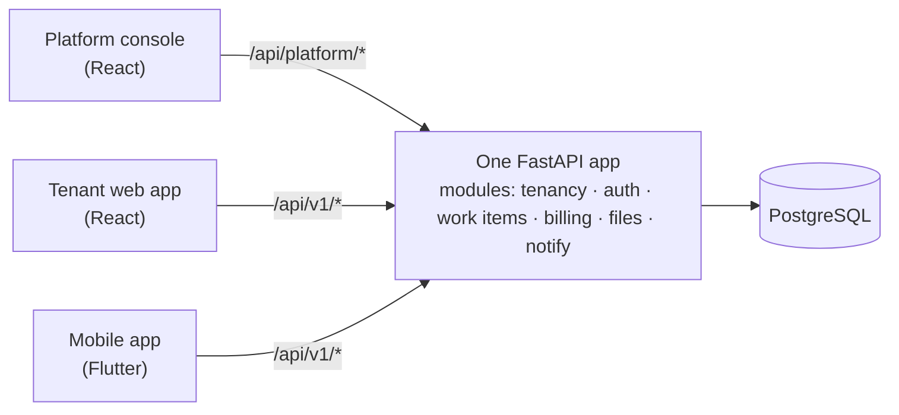

# 09 — One API, many clients

> **TL;DR** — One backend can serve a platform console, a tenant web app and a mobile app. Group
> routes by **audience**, publish an **OpenAPI contract**, return **one error shape** everywhere, and
> assume **old mobile builds will call you for years**.

## The shape



- **Platform routes** (`/api/platform/...`) are for your own operators — onboarding tenants, plans,
  support. They require platform roles and are never called by customer apps.
- **Tenant routes** (`/api/v1/...`) are shared by the web and mobile apps. Differences between
  clients should be *permissions and presentation*, not separate endpoints for the same thing.

Resist building a separate backend per client. One modular API with clear route groups is simpler
to secure, test and deploy.

## Contract first (or at least contract always)

FastAPI generates an OpenAPI document from your Pydantic models. Use it:

- Commit a snapshot (`openapi.json`) and **diff it in CI**. An unintended change to a response
  field shows up in review instead of in a crash report.
- Generate **typed clients** for React (TypeScript) and Flutter (Dart) from the spec, so a renamed
  field is a compile error, not a runtime `null`.

```python
# scripts/export_openapi.py
import json
from app.main import app

with open("openapi.json", "w") as f:
    json.dump(app.openapi(), f, indent=2, sort_keys=True)
```

```bash
# CI step
python scripts/export_openapi.py
git diff --exit-code openapi.json || (echo "API contract changed — review it" && exit 1)
```

## One error shape

Every client needs to show useful errors. Pick one envelope and enforce it with exception handlers:

```json
{
  "error": {
    "code": "work_item.invalid_transition",
    "message": "This item can't be approved from its current status.",
    "details": {"current": "assigned"},
    "request_id": "req_7Hc2…"
  }
}
```

```python
@app.exception_handler(DomainError)
async def domain_error_handler(request, exc: DomainError):
    return JSONResponse(status_code=exc.status, content={"error": {
        "code": exc.code, "message": exc.message, "details": exc.details,
        "request_id": request.state.request_id,
    }})

@app.exception_handler(RequestValidationError)
async def validation_handler(request, exc):
    return JSONResponse(status_code=422, content={"error": {
        "code": "request.invalid",
        "message": "Some fields are invalid.",
        "details": {"fields": [{"loc": e["loc"], "msg": e["msg"]} for e in exc.errors()]},
        "request_id": request.state.request_id,
    }})
```

Clients branch on `code` (stable, machine-readable), show `message` (human), and log `request_id`
so support can find the server log line. Make sure the handlers themselves can't crash — an error
handler that throws turns every 4xx into a 500.

## Designing for old mobile builds

Web clients update on refresh. Mobile apps update when users feel like it.

- **Additive changes only** within a version: new optional fields, new endpoints. Never rename or
  remove a field that a shipped build reads.
- Clients must **ignore unknown fields** and handle **unknown enum values** (show "Other" instead
  of crashing).
- Send the app version on every request (`X-App-Version: 3.4.1`) and keep a **minimum supported
  version** on the server. Below it, return a specific error code the app turns into an "Please
  update" screen.
- Introduce `/api/v2` only for genuinely breaking redesigns, and run both until usage of v1 drops.

```python
MIN_APP_VERSION = Version("3.2.0")

@app.middleware("http")
async def enforce_min_version(request, call_next):
    v = request.headers.get("x-app-version")
    if v and Version(v) < MIN_APP_VERSION:
        return JSONResponse(426, {"error": {"code": "app.update_required",
                                            "message": "Please update the app."}})
    return await call_next(request)
```

## Other cross-client rules

- **Pagination:** cursor-based (`?cursor=…&limit=50`) for feeds that change; return `next_cursor`.
- **Time:** always ISO-8601 UTC on the wire; clients localise.
- **Money:** minor units + currency code (doc 06).
- **Language:** accept `Accept-Language`, return translated `message`s; `code` never changes.
- **Refreshing the profile:** one `/me` endpoint that returns the user, active tenant, roles and
  permissions — so clients don't guess which profile endpoint to call based on user type.

## Failure modes

| Failure | Symptom | Prevention |
|---|---|---|
| Separate endpoints per client for the same data | Logic drifts, bugs fixed in one only | Shared routes, differences via permissions |
| Renamed response field | Old app builds crash | Additive-only changes, OpenAPI diff in CI |
| Hand-written client models | `null` where data was expected | Generated typed clients |
| Inconsistent error formats | Clients show "Something went wrong" for everything | One envelope with stable `code` |
| Error handler that can throw | 4xx become 500s | Test the handlers; keep them trivial |
| No minimum version | Ancient builds hit endpoints that no longer behave | `X-App-Version` + update-required code |
| Client picks profile endpoint by user type | Wrong profile / 403 for some roles | Single `/me` endpoint |

## Checklist

- [ ] Routes grouped by audience (platform vs tenant).
- [ ] OpenAPI snapshot committed and diffed in CI.
- [ ] Typed clients generated for web and mobile.
- [ ] One error envelope; handlers tested.
- [ ] Mobile compatibility rules written down; min-version check in place.
- [ ] `/me` returns everything a client needs to render navigation.
