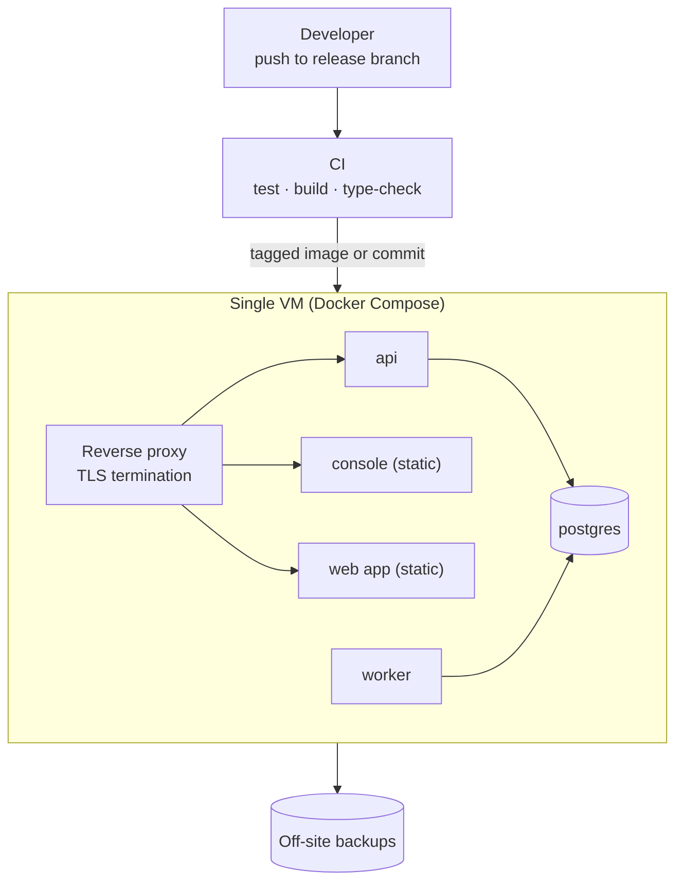

# 10 — Deploying with a small team

> **TL;DR** — A single VM running Docker Compose behind a reverse proxy is a perfectly good home for
> an early B2B SaaS. What matters is that deploys are **scripted, repeatable, loud on failure,
> verified by health checks, and reversible.**

## The setup



Why this is fine for a long time:

- One machine to understand, patch and monitor.
- Compose gives you declarative services, restart policies and health checks.
- Vertical scaling (a bigger VM) goes surprisingly far for a monolith.

When to outgrow it: you need zero-downtime rolling deploys across instances, regional redundancy,
or the database needs its own managed host. Move the **database first** (managed PostgreSQL), then
the app.

## The deploy script is production code

The most dangerous deploy script is one that *says* it succeeded. Here is a simplified, invented
script that shows a very common pattern:

```bash
# ❌ Looks safe. Isn't.
set -e

deploy_api() {
  git fetch origin && git reset --hard origin/release
  docker compose build app-api        # wrong name: service is called "api"
  docker compose up -d app-api
}

deploy_api || echo "deploy failed"
echo "✅ DEPLOY SUCCESSFUL"
```

Two traps combine here:

1. **`set -e` is ignored inside a function called as part of `||` or `&&`.** Bash suspends
   errexit for the whole function body, so the failed `build` doesn't stop anything.
2. The script **uses the container name instead of the Compose service name**, so every Compose
   command fails with "no such service" — and the only thing that actually ran was the `git reset`.

Result: new code on disk, old containers running, and a green "SUCCESSFUL" message. Nobody notices
until the next bug report doesn't match the code.

```bash
# ✅ Fail loudly, check each step, verify at the end.
#!/usr/bin/env bash
set -Eeuo pipefail

SERVICES=(api worker)          # Compose *service* names, checked below
log()  { printf '[%s] %s\n' "$(date -u +%H:%M:%S)" "$*"; }
fail() { log "❌ $*"; exit 1; }

for s in "${SERVICES[@]}"; do
  docker compose config --services | grep -qx "$s" || fail "Unknown service: $s"
done

PREV=$(git rev-parse HEAD)
git fetch origin release              || fail "git fetch"
git reset --hard origin/release       || fail "git reset"
NEW=$(git rev-parse --short HEAD)

docker compose build "${SERVICES[@]}" || fail "build"
./scripts/backup_db.sh                || fail "backup"
docker compose run --rm -T api alembic upgrade head || fail "migrate"
docker compose up -d "${SERVICES[@]}" || fail "up"

for i in {1..30}; do
  curl -fsS http://localhost:8000/health >/dev/null && { log "✅ $NEW healthy (was ${PREV:0:7})"; exit 0; }
  sleep 2
done
fail "health check timed out — roll back with: ./rollback.sh $PREV"
```

Key points: `set -Eeuo pipefail`, explicit `|| fail` on each step (so it works even if someone
later wraps it in a function), validate service names up front, print **which commit** is live.

## Health checks that mean something

- `/health` (liveness): the process is up. Cheap, no dependencies.
- `/ready` (readiness): can reach the database, migrations are at head. Used by the deploy script
  and the reverse proxy.
- Return the **running commit** in a `/version` endpoint. "What's deployed?" should never need an
  SSH session.

```python
@app.get("/version")
def version():
    return {"commit": os.environ.get("GIT_COMMIT", "unknown"),
            "built_at": os.environ.get("BUILD_TIME")}
```

Bake `GIT_COMMIT` into the image at build time (`--build-arg`), so the container reports what it
was *built from*, not what happens to be checked out on disk.

## Keep the server's working copy honest

- **No hand edits on the server.** If a hotfix is copied onto the VM, commit it upstream and
  redeploy from git. Otherwise the next `git reset --hard` silently deletes it — or git shows one
  commit while the container runs another.
- **Deploy credentials:** use a read-only **deploy key** per repository, not a personal token
  embedded in the remote URL. Personal tokens expire, leak into logs, and grant far more access than
  a deploy needs.
- **Check the build before the server does.** Run the same `type-check && build` in CI that the
  Dockerfile runs; a release branch that doesn't compile shouldn't reach the VM.

## Rollback

- Keep the previous image tagged (`api:previous`) or record the previous commit.
- Rolling back code is easy; rolling back **migrations** is not. That is why migrations are
  expand-only in the release that introduces them (doc 04) — the previous code still works with the
  new schema.

## Backups

- Nightly logical dump (`pg_dump -Fc`) + a dump before every migration.
- Copy off the VM (object storage in another region/account).
- **Test a restore** monthly into a scratch database. An untested backup is a hope, not a backup.

## Failure modes

| Failure | Symptom | Prevention |
|---|---|---|
| `set -e` suppressed inside `\|\|`-called function | Failed steps ignored, "SUCCESS" printed | Explicit `\|\| fail` per step; `set -Eeuo pipefail` |
| Container name used instead of service name | Every Compose command fails silently | Validate names against `docker compose config --services` |
| No post-deploy health check | Broken deploys reported as successful | Poll `/ready` and fail the script |
| Hand-edited files on the server | Git and running code disagree; fixes lost | Commit upstream, redeploy from git |
| Personal token in remote URL | Deploys break when it expires; secret exposure | Read-only deploy keys |
| Build breaks only on the server | Release branch doesn't compile | Same build in CI before deploy |
| Untested backups | Restore fails when you need it | Scheduled restore drill |

## Checklist

- [ ] Deploy script: strict mode, per-step failure checks, service names validated.
- [ ] Backup before migrations; migrations as a separate step.
- [ ] Health + readiness checks gate the deploy.
- [ ] `/version` reports the commit the image was built from.
- [ ] No manual edits on the server; deploy keys, not personal tokens.
- [ ] Rollback steps written down and tried once.
- [ ] Off-site backups with a tested restore.
