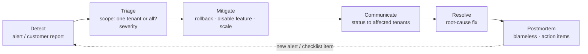

# 11 — Observability & incidents

> **TL;DR** — Log **structured JSON with `request_id` and `tenant_id`** on every line, watch a
> handful of **user-facing signals**, alert only on things a human must act on, and keep a
> **one-page runbook** per alert.

## The problem

Small teams don't have an SRE rotation. They have whoever notices first. Good observability for a
small team is less about dashboards and more about answering three questions fast:

1. **Is it broken?** (for whom — one tenant or everyone?)
2. **What changed?** (deploy, migration, config, provider outage)
3. **What do I do now?**

## Structured logs

```python
# observability/logging.py
import logging, json, time, uuid, contextvars

request_id_var = contextvars.ContextVar("request_id", default=None)
tenant_id_var = contextvars.ContextVar("tenant_id", default=None)

class JsonFormatter(logging.Formatter):
    def format(self, record):
        return json.dumps({
            "ts": time.strftime("%Y-%m-%dT%H:%M:%SZ", time.gmtime(record.created)),
            "level": record.levelname,
            "msg": record.getMessage(),
            "logger": record.name,
            "request_id": request_id_var.get(),
            "tenant_id": tenant_id_var.get(),
            **getattr(record, "extra_fields", {}),
        })

@app.middleware("http")
async def request_context(request, call_next):
    rid = request.headers.get("x-request-id") or f"req_{uuid.uuid4().hex[:12]}"
    request_id_var.set(rid)
    request.state.request_id = rid
    start = time.perf_counter()
    response = await call_next(request)
    logging.getLogger("http").info("request", extra={"extra_fields": {
        "method": request.method, "path": request.scope.get("route").path if request.scope.get("route") else request.url.path,
        "status": response.status_code, "ms": round((time.perf_counter() - start) * 1000),
    }})
    response.headers["x-request-id"] = rid
    return response
```

Rules:

- Log the **route template** (`/work-items/{item_id}`), not the raw path, so logs group well.
- **Never log** tokens, passwords, full card data, or file contents. Scrub known keys centrally.
- The `request_id` returned to clients (doc 09) is how a support request becomes a log search.

## The few metrics that matter

| Signal | Why | Alert when |
|---|---|---|
| Request error rate (5xx) | Users are failing | > a few % for 5 min |
| p95 latency per route group | Users are waiting | Sustained jump vs baseline |
| Outbox backlog / oldest pending age | Notifications are delayed | Oldest pending > 10 min |
| Webhook failures | Payments may be unrecorded | Any sustained non-2xx |
| DB connections in use | Pool exhaustion is near | > 80% of pool |
| Disk usage (DB + logs + images) | The classic silent killer | > 80% |
| TLS certificate expiry | Everything breaks at once | < 14 days left |
| Backup age | Recovery point is slipping | Last good backup > 26 h |

Add a **per-tenant** dimension to error rate and latency. "Everything is fine" on average can hide
"one large tenant is completely broken".

## Watch the watchers

Monitoring agents are software too. A metrics collector that burns a full CPU core, a dashboard
container that has been down for weeks, or a cache that stopped persisting to disk are all real,
common states. Include the monitoring stack itself in your health checks, and give every exporter
resource limits.

## Alerting without fatigue

- Every alert must be **actionable** and link to a runbook. If the right response is "ignore it",
  delete the alert.
- Page on **symptoms** (users failing), not causes (CPU high). Put causes on dashboards.
- One channel for alerts, separate from chatter.

## Runbook template

```markdown
# Alert: Outbox backlog growing

**Meaning:** notifications are queued but not being delivered.
**Impact:** users don't get assignment/approval notifications; app still works.

## Check
1. Is the worker running?          → `docker compose ps worker`
2. Recent worker errors?           → logs filtered by logger=worker, last 30 min
3. Provider status page green?
4. Stuck 'sending' rows?           → `SELECT count(*) FROM outbox WHERE status='sending' AND ...`

## Fix
- Worker down → `docker compose up -d worker`
- Provider outage → nothing; backlog drains on recovery (retries are safe)
- Stuck rows → run sweeper: `python -m jobs.sweep_outbox`

## Escalate if
Backlog still growing 30 min after fix.
```

## Incident flow



Mitigate before you diagnose: rolling back a deploy (doc 10) is usually faster than debugging it
live. Write the postmortem within a few days, blameless, with **owned action items** — and turn at
least one of them into a test, an alert or a checklist line.

## Failure modes

| Failure | Symptom | Prevention |
|---|---|---|
| Unstructured logs | Can't filter by tenant or request | JSON logs with context vars |
| Secrets in logs | Credential exposure | Central scrubbing, review log statements |
| Only average metrics | One tenant broken for hours unnoticed | Per-tenant error/latency |
| Alert on every cause | Alerts ignored | Symptom-based, actionable alerts only |
| Monitoring stack unmonitored | Blind for weeks | Health-check the monitoring itself |
| Expired certificates | Sudden total outage | Expiry alert with lead time |
| No runbooks | Every incident starts from zero | One page per alert |

## Checklist

- [ ] JSON logs include `request_id`, `tenant_id`, route template, status, duration.
- [ ] Sensitive fields scrubbed centrally.
- [ ] The eight signals above are collected; key ones per tenant.
- [ ] Every alert links to a runbook.
- [ ] Certificate, disk and backup-age alerts exist.
- [ ] Monitoring components have resource limits and health checks.
- [ ] Postmortem template in the repo.
