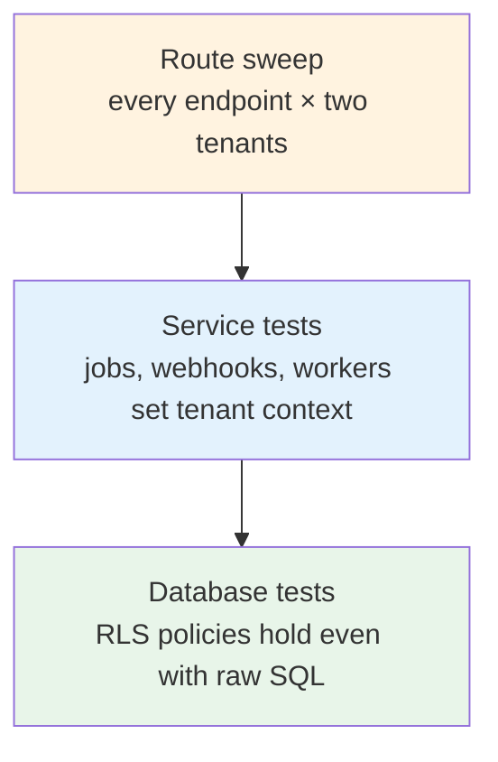

# 12 — Testing tenant isolation

> **TL;DR** — Create **two tenants in every test run**, act as tenant A, and prove you can't read,
> list, update, delete, upload to or subscribe to anything of tenant B's. Automate it across **every
> route**, and test the database policies **directly**.

## Why a separate doc

Most test suites create one tenant and test that features work. That proves nothing about
isolation — with a single tenant, a missing filter returns exactly the right data. Isolation bugs
only appear when there is **someone else's data to leak**.

## The testing pyramid for isolation



## Fixtures — always two tenants

```python
# tests/conftest.py
import pytest

@pytest.fixture
async def acme(db_admin):
    return await make_tenant(db_admin, slug="acme", admin_email="admin@acme.example")

@pytest.fixture
async def bluebird(db_admin):
    return await make_tenant(db_admin, slug="bluebird", admin_email="admin@bluebird.example")

@pytest.fixture
async def acme_client(app_client, acme):
    return app_client.with_token(token_for(acme.admin, tenant=acme))

@pytest.fixture
async def bluebird_item(db_admin, bluebird):
    return await make_work_item(db_admin, tenant=bluebird, title="Bluebird only")
```

## Layer 1 — database policies

Test RLS as the **application role**, with raw SQL, so no ORM helper can hide a bug:

```python
async def test_rls_hides_other_tenant_rows(app_role_conn, acme, bluebird_item):
    await app_role_conn.execute("SELECT set_config('app.tenant_id', $1, false)", str(acme.id))
    rows = await app_role_conn.fetch("SELECT id FROM work_items")
    assert bluebird_item.id not in {r["id"] for r in rows}

async def test_rls_blocks_cross_tenant_insert(app_role_conn, acme, bluebird):
    await app_role_conn.execute("SELECT set_config('app.tenant_id', $1, false)", str(acme.id))
    with pytest.raises(asyncpg.exceptions.InsufficientPrivilegeError):
        await app_role_conn.execute(
            "INSERT INTO work_items (tenant_id, number, title, created_by) VALUES ($1, 1, 'x', $2)",
            bluebird.id, bluebird.admin.id)

async def test_no_tenant_set_means_no_rows(app_role_conn, bluebird_item):
    rows = await app_role_conn.fetch("SELECT id FROM work_items")
    assert rows == []
```

And a meta-test so new tables can't skip RLS:

```python
GLOBAL_TABLES = {"tenants", "users", "alembic_version", "plans"}

async def test_every_tenant_table_has_forced_rls(db_admin):
    rows = await db_admin.fetch("""
        SELECT c.relname, c.relrowsecurity, c.relforcerowsecurity
        FROM pg_class c JOIN pg_namespace n ON n.oid = c.relnamespace
        WHERE n.nspname = 'public' AND c.relkind = 'r'
    """)
    missing = [r["relname"] for r in rows
               if r["relname"] not in GLOBAL_TABLES
               and not (r["relrowsecurity"] and r["relforcerowsecurity"])]
    assert not missing, f"Tables without forced RLS: {missing}"
```

## Layer 2 — services, jobs and webhooks

- A background job run for tenant A must not touch tenant B's rows.
- A webhook carrying tenant B's metadata must only update tenant B's records.
- A worker delivering an outbox row must only reach recipients in that row's tenant.

```python
async def test_digest_job_only_reads_own_tenant(acme, bluebird_item, capture_emails):
    await run_for_tenant(acme.id, send_daily_digest)
    assert all("Bluebird only" not in m.body for m in capture_emails)
```

## Layer 3 — the route sweep

Generate cases from the app's routes so new endpoints are covered automatically:

```python
def tenant_routes(app):
    for r in app.routes:
        if r.path.startswith("/api/v1/") and "{" in r.path:
            for method in r.methods - {"HEAD", "OPTIONS"}:
                yield method, r.path

@pytest.mark.parametrize("method,path", list(tenant_routes(app)))
async def test_cannot_touch_other_tenant(method, path, acme_client, bluebird_objects):
    url = fill_path_params(path, bluebird_objects)     # use Bluebird's ids
    resp = await acme_client.request(method, url, json=minimal_body_for(method, path))
    # 404, not 403: don't confirm that the id exists in another tenant.
    assert resp.status_code == 404, f"{method} {path} → {resp.status_code}"
```

Also sweep **list endpoints**: as Acme, every list response must contain zero Bluebird ids.

Don't forget the non-obvious surfaces:

- File downloads and upload-URL issuing (doc 08).
- Live channels: subscribing with Acme's token must never deliver Bluebird's events (doc 07).
- Search, exports, reports and counts — aggregates leak too ("12 results" when you should see 3).
- Error messages that echo another tenant's data.

## 404 vs 403

For another tenant's resource, return **404 Not Found**, not 403. A 403 confirms the id exists,
which leaks information and helps enumeration. Use 403 for "this exists in *your* tenant but your
role can't do this".

## Failure modes

| Failure | Symptom | Prevention |
|---|---|---|
| Single-tenant test fixtures | Leaks pass every test | Two tenants in every run |
| Testing RLS as superuser/owner | Policies look fine, aren't | Test as app role; `FORCE` RLS |
| New table without RLS | Silent leak in a new feature | Meta-test on `pg_class` |
| New endpoint not covered | Isolation untested for new routes | Route sweep generated from the router |
| Aggregates ignored | Counts/exports reveal other tenants | Include list/search/export in sweep |
| 403 for foreign ids | Id enumeration | 404 for cross-tenant access |

## Checklist

- [ ] Two tenants (Acme, Bluebird) in the default fixtures.
- [ ] RLS tested with raw SQL as the application role.
- [ ] Meta-test: every non-global table has forced RLS.
- [ ] Jobs, webhooks and workers have isolation tests.
- [ ] Route sweep covers every parameterised tenant route.
- [ ] List, search, export and count endpoints checked for foreign ids.
- [ ] Cross-tenant access returns 404.
- [ ] All of the above run in CI on every pull request.
